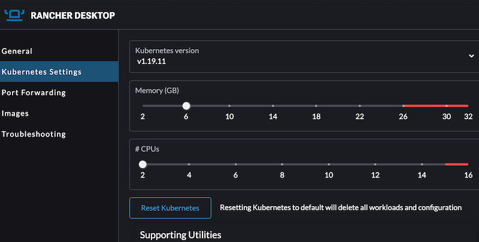
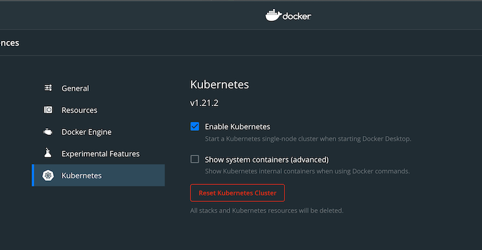

# Local dev with Go binary

## Run the Go binary with Equinix Metal

Assuming you're running a local cluster with [KinD](https://github.com/kubernetes-sigs/kind):

Sign up to [Equnix Metal](https://equinix-metal.com) and get an access key, save it in `~/equinix-metal-token`

```sh
export EQUINIXMETAL_PROJECT_ID=""	# Populate from dashboard

export GOPATH=$HOME/go/
go get -u github.com/inlets/inlets-operator
cd $GOPATH/github.com/inlets/inlets-operator

go get

kubectl apply -f artifacts/crds/

go build && ./inlets-operator  --kubeconfig "$(kind get kubeconfig-path --name="kind")" --access-key=$(cat ~/equinix-metal-token) --project-id="${EQUINIXMETAL_PROJECT_ID}"
```

## Run the Go binary with DigitalOcean

Assuming you're running a local cluster with [KinD](https://github.com/kubernetes-sigs/kind):

Sign up to [DigitalOcean.com](https://DigitalOcean.com) and get an access key, save it in `~/do-access-token`.

```sh
export GOPATH=$HOME/go/
go get -u github.com/inlets/inlets-operator
cd $GOPATH/github.com/inlets/inlets-operator

go get

kubectl apply -f artifacts/crds/

go build && ./inlets-operator  --kubeconfig "$(kind get kubeconfig-path --name="kind")" --access-key=$(cat ~/do-access-token) --provider digitalocean
```

## Run the Go binary with Scaleway

Assuming you're running a local cluster with [KinD](https://github.com/kubernetes-sigs/kind):
Sign up to scaleway and get create your access and secret keys
on [the credentials page](https://console.scaleway.com/account/credentials)

```sh
export GOPATH=$HOME/go/
go get -u github.com/inlets/inlets-operator
cd $GOPATH/github.com/inlets/inlets-operator

go get

kubectl apply -f artifacts/crds/

go build && ./inlets-operator \
  --kubeconfig "$(kind get kubeconfig-path --name="kind")" \
  --provider=scaleway
  --access-key="ACCESS_KEY" --secret-key="SECRET_KEY" \
  --organization-id="ORG"
```

## Run the Go binary with Hetzner

Assuming you're running a local cluster with [KinD](https://github.com/kubernetes-sigs/kind):
Sign up to Hetzner and get create your api key
on [the credentials page](https://docs.hetzner.com/dns-console/dns/general/api-access-token/)

```sh
export GOPATH=$HOME/go/
go get -u github.com/inlets/inlets-operator
cd $GOPATH/github.com/inlets/inlets-operator

go get

kubectl apply -f artifacts/crds/

go build && ./inlets-operator \
  --kubeconfig "$(kind get kubeconfig-path --name="kind")" \
  --provider=hetzner
  --access-key="ACCESS_KEY"
```

## Run the go binary with Azure and Rancher Desktop

Go to [Rancher Desktop](https://rancherdesktop.io/) and download and install Rancher Desktop.

Select your kubernetes version and take care to choose the `rancher-desktop` as kubernetes context



Sign Up at [Azure Portal](https://azure.microsoft.com/en-us/free/search/).

Use the azure cli to create a service principal (SP) and save the output to a json file.

```bash
az ad sp create-for-rbac --skip-assignment -o json > auth.json
```

Add the SP as contributor for the subscription:

```bash
az role assignment create --assignee "<appId>" \
--role "Contributor" \
--subscription "00000000-0000-0000-0000-000000000000"
```

Now we create a simple json file called `cred.json` with the necessary endpoints and SP details.

```bash
{
  "clientId": "<appId>",
  "clientSecret": "<password>",
  "subscriptionId": "00000000-0000-0000-0000-000000000000",
  "tenantId": "<tenant>",
  "activeDirectoryEndpointUrl": "https://login.microsoftonline.com",
  "resourceManagerEndpointUrl": "https://management.azure.com/",
  "activeDirectoryGraphResourceId": "https://graph.windows.net/",
  "sqlManagementEndpointUrl": "https://management.core.windows.net:8443/",
  "galleryEndpointUrl": "https://gallery.azure.com/",
  "managementEndpointUrl": "https://management.core.windows.net/"
}
```

```bash
export GOPATH=$HOME/go/
go get -u github.com/inlets/inlets-operator
cd $GOPATH/github.com/inlets/inlets-operator

go get

kubectl config use-context rancher-desktop
kubectl apply -f artifacts/crds/
kubectl config view --flatten --minify > kubeconfig.yaml
go build . && ./inlets-operator --kubeconfig kubeconfig.yaml --provider azure \
--subscription-id=00000000-0000-0000-0000-000000000000 --access-key-file=./cred.json \
--region westeurope
```

As Rancher Desktop already comes with an inbuild traefik, you can work directly with ingress or expose your service as
usual

## Run the go binary with Linode and Docker Desktop Kubernetes

Enable the Kubernetes in the preferences.



Be sure that you choose `docker-desktop` as kubernetes context

Sign up at [Linode](https://login.linode.com/signup) and get the Linode API token.

```bash
export LINODE_CLI_TOKEN=<linode-api-token>
 
export GOPATH=$HOME/go/
go get -u github.com/inlets/inlets-operator
cd $GOPATH/github.com/inlets/inlets-operator

go get

kubectl config use-context docker-desktop
kubectl apply -f artifacts/crds/
kubectl config view --flatten --minify > kubeconfig.yaml
go build . && ./inlets-operator --kubeconfig kubeconfig.yaml --provider linode --access-key=$LINODE_CLI_TOKEN --region eu-central
```
